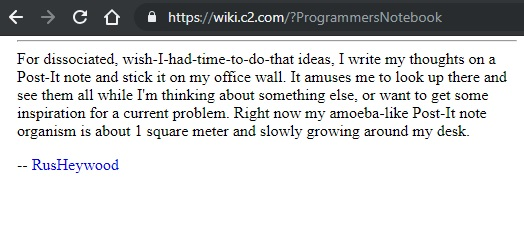

# Changelog

**2020/06/19**
- came up with name, started building frontend
- using a json-server to a temporary data file
- set up React to show the Post data for each post
- setting up typicons
- added basic functionality for filtering

**2020/06/23**
- added about modal
- added new post modal
- added the beautiful tabbed input for tags for new post
- added keyboard shortcuts for the modals
- refactored the filtering to work with queries and for type/status/tag

**2020/06/24**
- completed the functionality of new post modal in frontend
- added frontend functionality to change todo status by clicking on icon
- fixed css to display the filter and tags in nav bar to make sure everything is aligned
- done some shenanigans to ensure masonry layout with css and the posts are sort of sorted
- made a dummy json file with 300 posts to stress test system; it renders alright
- just a teeny bit of css :) i still have the idea for little monospace post it colors though
- bugfix: when clicking on the status change icon on a new view, the displaylist rerenders and masonry changes?? -> problem solved, i had to call reorder when the posts update and i redraw displaylist too!
- default sort posts according to date descending (lol i just used displayArray.reverse())

**2020/06/25**
- 100r css
- asked kormyen for permission :)

**2020/06/29**
- initial changes for mobile (css)
- i need to handle the case where, on github pages, since the api doesn't exist, i have to serve a set of default posts
	SOLVED! fixed the getAll() in postsService to be able to return a set of default posts on error (.catch(), in cases of 404)

**2020/06/30** v.1.0.0
- finalized some mobile changes (add buttons on the tag/comment field), more css
- have a set of default/demo posts for github pages
- add the loading animations
- completed backend integration with mongo!
- added json export

**2020/07/01**
- made icons and logo 
- cleaned up the repos and ready to show on github

## Origin

I completed the fullstackopen course to learn React, and I need a project to work on. I saw this idea on c2 wiki of this person that writes his dissociated thoughts on a post it note, sticking it up on a wall and forming a collection of serendipitous inspiration. 

I also stumbled upon [kormyen's memex](https://kormyen.github.io/memex/), which was a nice implementation of this idea.

I decided to build a tool for myself, because why not?

I struggled with the name for the longest time. I liked the meaning of the word and using an uncommon Chinese word is cool to me (compared to fancy Japanese words wow). But to spell out a word that gets the idea across is quite challenging. I think 'tyea' fits the best but it perhaps still isn't as good as 'tiē' either. Other ideas I had:

- Tyeah
- Theah
- Thyea
- Tiye
- Teaea (like 'queue')
- Tieh

## Some potential todo/improvements

- Able to add comments after the notes are made -> should this be the formation of a brand new note that hyperlinks to the original? Or should I just tack on comments/further understanding at the bottom?
- Pagination? Or infinite scroll? So far performance was ok for up to 300+ posts. Time shall tell whether I have to implement this feature... 
- Able to return a random todo resource
- Connect my API to a Telegram bot so I can go back to messaging stuff to myself :") ...
