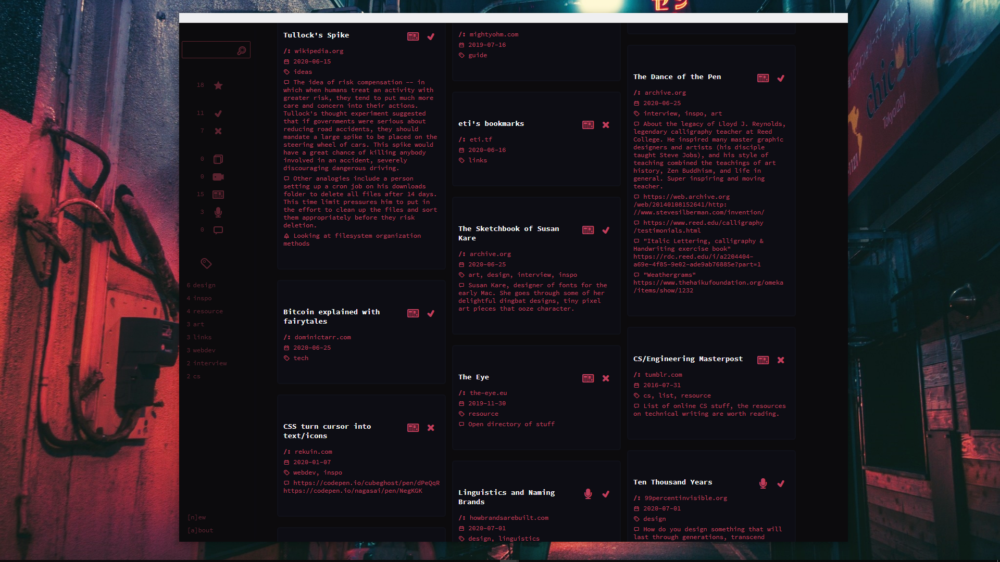

# Tyea


## [View the live demo here](https://qreoct.github.io/tyea)

Tyea is a digital wall for sticky notes. It is designed to be quickly accessible and a safe place to store ideas and links that can be easily searchable when the time comes. 

Tyea [(贴)](https://en.wiktionary.org/wiki/%E8%B2%BC#Mandarin) is the Chinese word for "to stick on to". After years of sporadic bookmarking, sending emails and WhatsApp messages to myself in an attempt to save content that I enjoyed, I wanted a tool that achieves this task for me in a centralized location. Use it as a personal knowledge base. Tyea is built with React to practice building an application that I could use.

You can:
- Add posts with a url, tags, comments, and mark the type of content.
- Mark posts as "todo" or "done" so you can revisit.
- Quickly search & filter through posts on the wall.
- Export all your data at any time in JSON.
- Theme your application with [Hundred Rabbit's Themes](https://github.com/hundredrabbits/Themes) framework! Light themes don't work so well...

  

## Setting up TYEA for your own use

Make a heroku account and set it up in your CLI.
```
git clone git@github.com:qreoct/tyea.git
cd tyea

heroku create
git push heroku master
```
Create a MongoDB collection to store the posts. 

Go to heroku and add your MongoDB URI as a [config var](https://devcenter.heroku.com/articles/config-vars). The variable name should be ```MONGODB_URI```

## Repo structure

Branch ```master``` contains the directory ```react-frontend``` which is a npm project that houses the frontend. Make changes that you want to the frontend, and then run 

```
npm run build
```

to get a ```build``` directory. Put this ```build``` directory in the root of this repo and push to heroku in order to update with frontend changes. 

For all backend changes, the root directory contains the backend npm project. Create a ```.env``` file with the following structure:

```
MONGODB_DEV_URI='...'
MONGODB_URI='...'
PORT=...
```

Branch ```gh-pages``` houses the static content for gh-pages release.

Branch ```gh-pages-dev``` houses the frontend code for gh-pages.

## Dependencies
- [Typicons](https://www.s-ings.com/typicons/) (for icons)
- [react-loading](https://www.npmjs.com/package/react-loading) (for loading animation)

## Thanks

- Kormyen's [Memex project](https://github.com/kormyen/memex)

## Extras

[View the changelog and other notes I wrote](CHANGELOG.md)

### Todo

- Auto-add comment if you forget to click the 'add' button. Happens quite often actually.
- Ability to turn links in comments to hyperlinks
- Refactor CSS for New Post to work better with widescreen monitors (maybe have the comment field automatically expand?)
- Edit button for existing posts

Feel free to fork/comment/pull request etc. The code is licensed under MIT.

